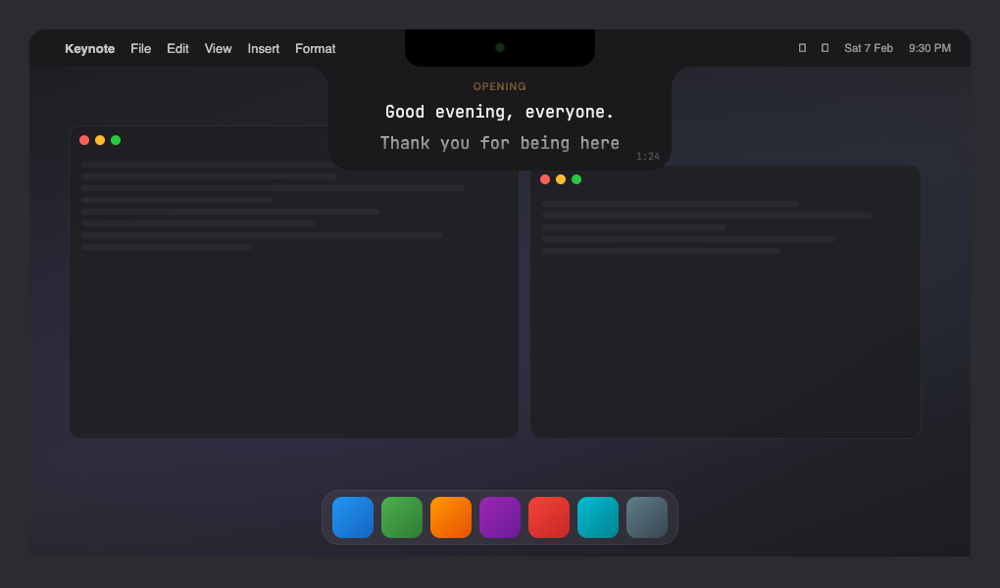

# Tele

A teleprompter that lives in your MacBook's notch — right below the camera, so your eyes stay where they should be.



Your script scrolls directly under the lens. To your audience, you're just looking at the camera. Natural eye contact, zero guesswork.

### Why Tele?

- **Invisible on screen share** — content-protected window, so only you see it. Present on Zoom, Google Meet, or any call without anyone knowing.
- **Keyboard-driven** — global shortcuts for play/pause, speed, and seeking. Hands stay on the keyboard, flow stays unbroken.
- **Markdown-aware** — headers, bold, italic, stage directions (`[pause]`), and separators. Write structured scripts, read clean output.
- **Fully local** — no accounts, no cloud, no telemetry. Your scripts stay in localStorage, config in a local JSON file.
- **Free and open source** — MIT licensed. Modify it, extend it, make it yours.

## Getting started

```
npm install
npm run dev
```

## Build

```
npm run build
npm start
```

## License

MIT

